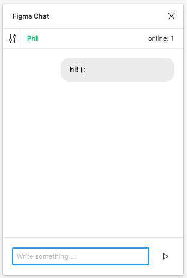
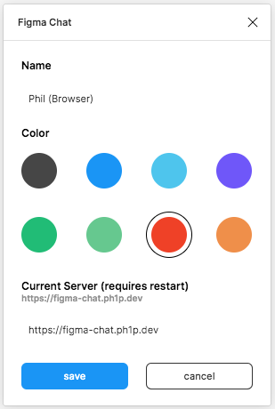

 # figma-chat


A plugin to chat in figma files. Fully **encrypted**! (https://github.com/sehrope/node-simple-encryptor)





### Encrypted? No login?

Yes. When opening the plugin a **room** name and a **secret key** are randomly generated once
and stored inside the `figma.root`. All editors within the file can access this attribute.

```javascript
figma.root.setPluginData('roomName', '');
```

All messages are en- and decrypted with the stored secret key and send to the server.

### Server

This plugins needs a server ([https://github.com/ph1p/figma-chat-server](https://github.com/ph1p/figma-chat-server)).
This is a simple websocket server. **Messages are only forwarded and not stored!**

---

At first I thought about saving the messages in one element inside the figma-file,
but the plugin can't be notified when a new message arrives.
The plugin must set an interval that asks for new updates every n milliseconds.

### Todolist/Featurelist

- [x] set custom server URL ([https://github.com/ph1p/figma-chat-server](https://github.com/ph1p/figma-chat-server))
- [ ] add leave and join message
- [ ] add typing info
- [ ] notifications
- [x] save local history
- [x] create a shared history
- [ ] users/instances can delete messages
- [ ] regenerate new room name and secret key
- [ ] create a random unique user name to detect returning users on server and inside a figma file
- [ ] remove all messages
- [ ] add max message count to prevent a to large object inside the figma file

Feel free to open a feature request: https://github.com/ph1p/figma-chat/issues

### Development

```bash
git clone git@github.com:ph1p/figma-chat.git
cd figma-chat
npm install
```

```bash
npm run build
```
or

```bash
npm run dev
```

* Open figma
* Go to **Plugins**
* Click the "+" next to **Development**
* Choose the manifest.json inside `figma-chat/Figma Chat`
* Ready to develop